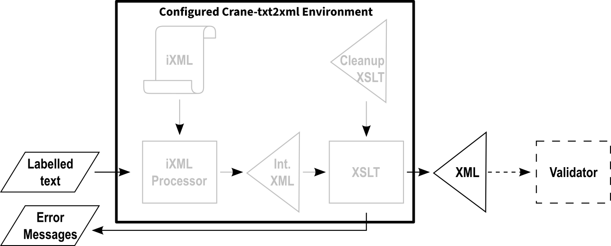

# Crane-txt2xml Author's Guide

This guide describes how to write structured text that the Crane-txt2xml environment converts into XML. It covers the text syntax universal to all vocabulary environments built with Crane-txt2xml.

This guide does **not** cover which elements and attributes are available in your particular vocabulary, how they nest, or which are required, repeatable, or optional. That information comes from your vocabulary's own documentation, provided by whoever set up your environment. Moreover, there is no "raw" or "anonymous" mode of operation that is not governed by an explicit schema structure with named elements dictating the nesting of constructs.

## What You Are Doing As An Author

You are creating XML syntax. Your organization needs XML documents — invoices, articles, data records — and you are providing the content using simple text following simple conventions. The Crane-txt2xml environment creates the XML syntax (angle brackets, closing tags, namespace declarations) so you do not have to type or see any of the angle brackets.



Your text consists of **labels for elements**, **labels for attributes**, and **content for both**. The environment knows the structural rules of your XML vocabulary and uses them to produce correctly nested XML from your text.

If you need to round-trip an existing XML document using this syntax for editing purposes, each environment has the equivalent of the `Crane-xml2txt.xsl` stylesheet.

## Example Vocabulary

To illustrate the text syntax, this guide uses a simple Recipe vocabulary with the following structure found in the [Recipe.xsd](Recipe.xsd) XML schema:

- A **Recipe** contains a **Title**, one or more **Ingredient** entries, and one or more **Step** entries.
- Each **Ingredient** contains a **Name** and an **Amount**.
- An **Amount** has a mandatory **unit** attribute, an optional **approximate** attribute, and text content
- **Title**, **Name**, and **Step** hold text content.

This vocabulary is for illustration only. Your actual environment will have different elements and attributes, documented by your implementer.

## Elements

An element specification is an element label followed by zero or more interspersed value and attribute specifications.

An element label is the element's name or alias followed by a colon.

When multiple attribute specifications for a given element use the same name or equivalent alias, only the last one of these is put in the XML output. This might be exploited by composing a default attribute specification initially (by program generation) and editing the result with an overriding value.

The output content of an element defined as `xs:string` is the combination of all of that element's value specifications, joined by a single space separator between each. Use a single quoted string to have more control over all of the spaces.

The output content of an attribute defined as `xs:string` is a single value specification which, itself, may be a quoted string with spaces.

The output content of an item defined as `xs:boolean` is one of the four values: `true`, `false`, `1`, and `0`.

The output content of an item defined using any other XSD data type is a single value specification representing that token value.

The vocabulary documentation should highlight which of the item values are `xs:string` or otherwise a single token.

The following is the specification of an element labeled "Title":

```
Title: Pancakes
```

This produces an XML element named `Title` with the text content `Pancakes`.

Container elements — elements that hold other elements rather than text — use the same syntax. The label marks where the container begins, and the environment determines where it ends based on the vocabulary's structural rules:

```
Ingredient:
  Name: Flour
  Amount: @unit: cups 2
```

Here, `Ingredient:` is a container. It has no text content of its own; it contains `Name` and `Amount` as child elements. The author does not need to write anything to "close" or finish the `Ingredient` — the environment handles that automatically.

## Attributes

Attributes qualify an element with additional information.

An attribute specification is an attribute label followed by exactly one value specification. Use the pair of empty quotes (`""`) to output empty attribute content.

An attribute label begins with `@`, followed by the attribute name or alias, followed by a colon.

```
@unit: cups
```

This produces a `unit` attribute set to `cups`.

When an element has both attributes and text content, the order is important. All attributes must come before any text content:

```
Amount: @approximate: yes @unit: cups 2
```

In the example, an "`Amount`" element is created with two attributes, "`unit`" and "`approximate`", and element content of "`2`".

Note that only Boolean attribute values are checked for correct syntax. At this time, the syntax of other attribute values is not checked.

Attribute names are checked. Mandatory attributes are checked to be present. The order of mandatory and optional attribute specifications is not important. When more than one attribute of a given name is specified for an element, the last value specified is used. At least one attribute specification for each of the mandatory attributes of an element must be indicated for every one of those elements.

## Label name aliases

Your vocabulary environment may define alternative labels for some element and attribute names. For example, a UBL environment might accept both `InvoiceLine:` (the XML element name) and `Invoice Line:` (a more readable alias) for the same element `<InvoiceLine>`. A PubMed environment offered in German might accept both `Article:` and `Artikel:` for `<Article>`.

Every environment always accepts the actual XML names as labels. Aliases are additional options provided by the implementer for convenience. Your vocabulary documentation will list any aliases available to you.

## Value specifications

A value specification is either unquoted or quoted.

### Unquoted Value Specifications

An unquoted value specification is a bare token — a sequence of characters with no white-space, followed by white-space. It needs no delimiters, but it is prohibited from containing a double-quote, a colon, or an at-sign, unless backslash-escaped. These characters must be backslash escaped, or the entire specification must be double-quoted (in which case the double-quote again needs to be escaped).

```
Title: Pancakes
Amount: @unit: cups 2
```

`Pancakes`, `cups`, and `2` are all unquoted value specifications.

A sequence of unquoted value specifications is output with a single space between each as the resulting content. Each of these produces the output "`Mix ingredients together`":

```
Step: Mix ingredients together
```

... is the same as:

```
Step:
  Mix
  ingredients
  together
```

### Quoted Value Specifications

A quoted value specification is surrounded by double quotes (and not by single quotes). The first of the following is equivalent to the above, while the second is very different with new-lines throughout:

```
Step: "Mix ingredients together"
```

... is *not* the same as:

```
Step: "
Mix
ingredients
together
"
```

Quoted value specifications may be used when quoting is not strictly necessary. `Name: "Flour"` and `Name: Flour` produce identical results. When in doubt, quote.

## When Quoting Or Escaping Is Required

A given value specification **must** be quoted or escaped in these situations:

- the value starts with or ends with white-space characters, or contains white-space characters other than a space, or contains a sequence of more than a single space
- the value includes `@`, which would otherwise be interpreted as the beginning of an attribute label: `"@home"`
- the value includes `:`, which would otherwise be confused with an element label: `"Note:"`
- the value includes `/`, which would otherwise be confused with an element's disambiguation signal: `"https://example.com"`
- the value is one defined as mixed-content and includes a markdown signal character, which would otherwise be interpreted as an element start/end for that element represented by the signal

A simple rule of thumb: if a single value specification contains anything other than plain letters, digits, hyphens, and periods, quoting it is the safe choice, though not a formal summary of constraints.

Corollary: since an element's content is the single-space-separated combination of multiple value specifications, one is able to omit quotes and end up with the desired output using multiple value specifications, e.g.:

```
    Name: "Neddie Seagoon"
```
... can be:
```
    Name: Neddie Seagoon
```
... but both are different than having two spaces between the name parts:
```
    Name: "Neddie  Seagoon"
```
The content of empty elements may be specified using empty quotes `""` but when not ambiguous starting the next element should be enough to recognize the element as empty.


Escaping is in play at all times, inside a quoted or unquoted value specification. Use a backslash to introduce an escaping sequence:

- needed only in unquoted value specifications but also is recognized in quoted value specifications
  - `\:` produces a literal colon
  - `\@` produces a literal at-sign
  - `\/` produces a literal oblique or forward slash
- always needed in both quoted and unquoted value specifications
  - `\"` produces a literal double quote
  - `` \` `` produces a literal back-tick
  - `\\` produces a literal backslash
  - `\{"0"-"9" | "A"-"F" | "a"-"f"}+\` produces a single Unicode character of the value of the hex characters escaped
    - e.g. `\A0\` for NBSP 
    - note that the trailing backslash is mandatory, is processed, and has no impact on the following character in the input
- other uses of the backslash are considered invalid and reserved for future use so will return a parsing error

For example, a step that contains quotation marks:

```
Step: "Flip when you see \"bubbles\" forming \1FAE7\"
```

This produces the element content: `Flip when you see "bubbles" forming 🫧`

Escaping also works in unquoted value specifications. A backslash followed by any character produces that character literally, with the backslash removed. This can be used to include `@` or `"` at the start of an unquoted value without switching to a quoted value:

```
Name: \@special
```

This produces the text content: `@special`

## Back-tick quoting

A string demarcated by back-ticks `` `a *string* of characters` `` is sensitive to the presence of markdown characters therein, such as shown by the use of the asterisks. But such is useful only when the vocabulary has defined certain characters as the on/off toggles of the mixed-content encoding of the content between the signals. Otherwise, it is the same as double-quoting.

See the PubNoteIn-text2xml facility in the \<PubNote> project for an example of mixed-content and the use of markdown characters.

## White-space

White-space (spaces, indentation, tabs, line breaks) between labels and value specifications is insignificant. The environment ignores it. You may use white-space freely for readability, or omit it entirely. Indentation does not infer structured nesting, the schema does that job based on the labels.

The following three inputs produce identical XML output.

Expanded and indented, with one component per line:

```
Recipe:
  Title: Pancakes
  Ingredient:
    Name: Flour
    Amount: @unit: cups 2
  Ingredient:
    Name: "Maple Syrup"
    Amount: @unit: tablespoons
            @approximate: "yes"
            3    
  Step: "Mix ingredients together"
  Step: "Cook on a greased griddle"
  Step: Serve
```

Compressed, all on one line, white-space separated:

```
Recipe: Title: Pancakes Ingredient: Name: Flour Amount: @unit: cups 2 Ingredient: Name: "Maple Syrup" Amount: @unit: tablespoons @approximate: "yes" 3 Step: "Mix ingredients together" Step: "Cook on a greased griddle" Step: Serve
```

Very compressed, with only the absolute minimum required white-space around unquoted value specifications (always after, sometimes before):

```
Recipe:Title:Pancakes Ingredient:Name:Flour Amount:@unit:cups 2 Ingredient:Name:"Maple Syrup"Amount:@unit:tablespoons @approximate:"yes" 3 Step:"Mix ingredients together"Step:"Cook on a greased griddle"Step:Serve
```

All produce the same XML conforming to [recipe/recipe-garden-of-eden.xsd](recipe/recipe-garden-of-eden.xsd):

```xml
<Recipe>
  <Title>Pancakes</Title>
  <Ingredient>
    <Name>Flour</Name>
    <Amount unit="cups">2</Amount>
  </Ingredient>
  <Ingredient>
    <Name>Maple Syrup</Name>
    <Amount unit="tablespoons" approximate="yes">3</Amount>
  </Ingredient>
  <Step>Mix ingredients together</Step>
  <Step>Cook on a greased griddle</Step>
  <Step>Serve</Step>
</Recipe>
```

Use whatever layout makes the content easiest for you to read and edit. Indentation, line breaks, and spacing are entirely your preference.

### When White-space Is Required

There is one constraint: at least one white-space character **is** required after every unquoted value specification. That can be a space, a tab, a carriage return, or a line feed (Enter).

Otherwise, you use white-space freely for readability (as most authors will).

## Structural disambiguation signals

Every element that is started with `Name:` can be ended with `/Name` as an explicit indication of the element having no more content.
As described in the next section this is only very rarely needed and for most vocabularies such never is needed.

Authors may choose to express the ends of elements for cosmetic purposes when they aren't required, though this is entirely optional for most vocabularies where structural disambiguation is not needed.

### When Structural Disambiguation Is Required

Disambiguation is mandatory in the areas when the XML vocabulary is structurally ambiguous. Typically this occurs when elements of the same name are optional and are permitted to appear in more than one place. Not all vocabularies are structurally ambiguous, and often it is a matter of discovering they are based on the input triggering an ambiguity.

The vocabulary documentation should indicate when elements require structural disambiguation, and for the others it can be considered optional.

## Warning Messages Converting XML to Text

When not using markdown characters in mixed content, one uses start and end indicators, e.g. `b:` and `/b` in the text stream to indicate the start and end of element content. For example, the following XML:

```
<b>bold stuff <i>bold and italic <b>redundant bold</b> more</i> and last bit</b>
```

... is expressed as:

```
b:"bold stuff "i:"bold and italic "b:"redundant bold"/b" more"/i" and last bit"/b
```

When using markdown characters, this example XML produces an ambiguous text result because a bold element is nested inside of another bold element, thus the start of the nested bold is incorrectly interpreted as the end of the outer bold:

```
*bold stuff /bold and italic *redundant bold* more/ and last bit*
```

In these cases the `Crane-xml2txt` process gives the warning regarding the ambiguous markdown output:

`Warning: using markdown characters instead of start/end indicators for the XML element PubMedIn-mixed.xml/ArticleSet/Article/Abstract/AbstractText[2]/b[2]/i/b is producing known ambiguity problems in the generated text.`

The workaround is to not use markdown for these situations and use explicit start and end indicators for mixed content descendants.

## Error Messages Converting Text to XML

When the environment detects a problem with your text, it produces an error message instead of (or in addition to) XML output. Errors are reported in plain language, not in XML syntax.

Common causes of errors include:

- A misspelled element or attribute label
- Elements in the wrong order (your vocabulary defines a specific sequence)
- A required element that is missing
- An element used where the vocabulary does not permit it
- An element or attribute label does not end with a colon
- An unquoted value specification isn't followed by white-space

The specifics of what constitutes valid structure depend entirely on your vocabulary. Consult your vocabulary's documentation for guidance on which elements go where.

## Validation

Successfully generating the XML output guarantees the order and structure of elements to be schema-valid, but not the presence, names, or contents of attributes.

**It is recommended always** to validate the XML generated from this environment using the document's governing schema.

## Quick Reference

| Syntax | Meaning | Example |
|---|---|---|
| `label:` | Element content start | `Title: Pancakes` |
| `/label` | Element content end   | `/step`
| `@label:` | Attribute value herald | `@unit: cups` |
| value | Unquoted value specification | `Pancakes` |
| `"value"` | Quoted value specification | `"Maple Syrup"` |
| `\"` | Escaped quote in a value specification | `"say \"hello\""` |
| `\:` | Escaped colon in a value specification | `NotALabel\:` | 
| `\@` | Escaped at-sign in a value specification | `\@AlsoNotALabel` | 
| `\\` | Escaped backslash in a value specification | `"path\\to\\file"` |
| `\hex\` | Escaped Unicode characterin a value specification | `\1FAE7\` |
