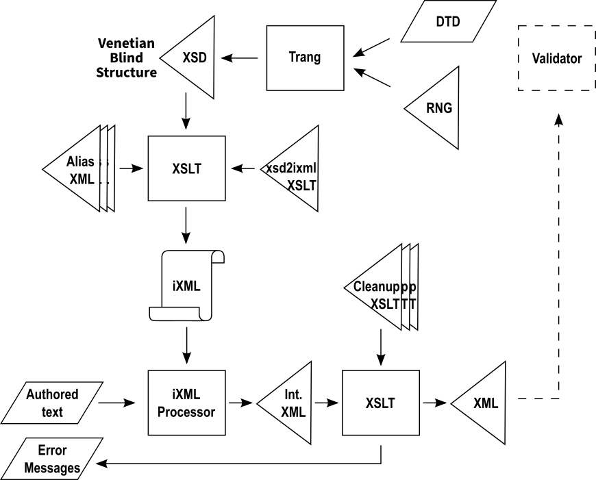

# Crane-txt2xml Implementer's Guide

This guide is for XML practitioners creating a vocabulary environment — adapting Crane-txt2xml for a specific XML vocabulary so that authors can create documents in that vocabulary by typing structured text.

It assumes familiarity with XML, XSD, XSLT, and the basics of Invisible XML (iXML). If you are an author looking to write text for an existing environment, see the [Author's Guide](AUTHORING.md).

## Architecture Overview

A Crane-txt2xml vocabulary environment is produced in two phases: a configuration phase (your work as implementer) and a runtime phase (the author's experience).


### Configuration Phase

You provide three inputs to the Crane-txt2xml generation pipeline:

1. **A "Venetian Blind" or "Garden of Eden" XSD schema** for the target XML vocabulary. All global type declarations must follow the Venetian Blind convention. If your vocabulary is defined in RELAX NG or DTD form, use [Trang](https://relaxng.org/jclark/trang.html) to produce a compatible XSD — provided the schema is expressible in XSD.

2. **An Alias XML document** mapping natural-language element and attribute labels to their XML names. Each XML element name may have multiple labels (aliases). Every environment implicitly supports the raw XML element names as labels; the aliases you define are additive.

3. **A Cleanup XSLT stylesheet** that transforms the intermediate XML produced by the iXML processor into the final output. This stylesheet handles attribute alias resolution, namespace assignment, and any other serialization requirements of the target vocabulary.

These three inputs are processed by the **xsd2ixml XSLT stylesheet** (provided in the base Crane-txt2xml distribution), which generates:

- An **iXML grammar** tailored to the vocabulary, encoding the content models from the XSD and the label alternatives from the Alias XML.
- The **Cleanup XSLT stylesheet** that you provide is bundled with the generated grammar for use at runtime.




### Runtime Phase

The author's experience is a simple pipeline:


1. The **iXML processor** parses the authored text against the generated iXML grammar, producing intermediate XML. If the text contains element structure or naming errors, the processor produces error output instead.

2. The **Cleanup XSLT** transforms the intermediate XML into the final output, resolving attribute aliases, assigning namespaces, and performing any vocabulary-specific serialization.

3. Optionally, the output XML is **validated** against the vocabulary's schema (DTD or RELAX NG) to catch attribute usage errors and any structural issues not fully constrained by the iXML grammar.

The author interacts with this pipeline through a turnkey mechanism (command-line invocation, drag-and-drop, or whatever delivery method you choose). They see either the final XML output or plain-language error messages.

## Error Handling

Errors are detected at three stages, each catching different classes of problems:

### Stage 1: iXML Parsing

The iXML grammar encodes the vocabulary's element content models. When the authored text violates element structure — misspelled element labels, wrong element order, missing required elements, elements in impermissible locations — the iXML processor reports errors.

The iXML processor's error output is in XML (in the iXML namespace). The Cleanup XSLT detects this by namespace — output in the iXML namespace indicates errors; output in the target namespace indicates success. Your Cleanup XSLT should transform the iXML error XML into plain-language messages suitable for a lay author. The goal is to distill the error context into guidance the author can act on without understanding XML or iXML diagnostics.

### Stage 2: Cleanup XSLT

The Cleanup XSLT handles attribute alias resolution. If an author uses an attribute label that does not map to a recognized attribute name, the Cleanup XSLT can detect and report this. Attribute naming errors are caught here rather than at the iXML stage because the iXML grammar captures attribute names dynamically (via the `name` production) without constraining them to specific values.

### Stage 3: Schema Validation

Post-generation schema validation catches attribute usage errors — an attribute on an element that does not permit it, a required attribute that is missing, or an attribute value that does not conform to the schema's type constraints. It also serves as a safety net for any element-level structural issues that the iXML grammar might not fully constrain.

Use the vocabulary's DTD or RELAX NG schema (produced via Trang from the XSD if needed) for this validation step.

## The XSD Schema

The xsd2ixml generation stylesheet requires a Venetian Blind XSD. In this convention, all type definitions are global (named) types, and element declarations reference these types. This allows the stylesheet to traverse the content models systematically and generate iXML rules for each element.

If your vocabulary's authoritative schema is in RELAX NG or DTD form, convert it to XSD using Trang:

```
trang -I rnc -O xsd schema.rnc schema.xsd
trang -I dtd -O xsd  schema.dtd schema.xsd
```

Verify the resulting XSD follows the Venetian Blind convention. Not all schema languages convert cleanly; manual adjustment may be necessary.

## The Alias XML

The Alias XML document defines alternative labels for element and attribute names. Each alias maps one or more natural-language label forms to a single XML name.

Design considerations for aliases:

- **Raw XML names are always supported.** An author can always use the actual XML element name (e.g., `AccountingSupplierParty:`) regardless of what aliases exist. Aliases are additive.
- **Multi-word labels.** Aliases may contain whitespace. For example, the UBL implementation breaks camelCase element names into separate words: `Invoice Line:` as an alias for `InvoiceLine`. The iXML grammar accommodates optional whitespace within multi-word labels.
- **Multiple languages.** Different environments can define aliases in different natural languages for the same vocabulary. For example, Crane-txt2pubmed offers language-specific distributions (Crane-txt2pubmed-de, Crane-txt2pubmed-fr) where element labels are available in German, French, and so on, alongside the English XML names.
- **Multiple aliases per name.** A single XML element name may have several aliases — abbreviations, full names, translations — all mapping to the same output element.

<!-- TODO: Document the Alias XML format and schema -->

## The Cleanup XSLT

The Cleanup XSLT stylesheet transforms the intermediate XML produced by the iXML processor into the final vocabulary-conformant XML output. Its responsibilities include:

- **Namespace assignment.** The intermediate XML uses the namespace declared in the iXML grammar's `nineml ns` pragma. The Cleanup XSLT maps elements to the correct namespace(s) for the target vocabulary (e.g., separating UBL common basic components from aggregate components).
- **Attribute alias resolution.** If you define attribute aliases, the Cleanup XSLT maps the authored attribute names to their canonical XML attribute names.
- **Error detection for attributes.** Attribute labels that cannot be resolved to known attribute names should be reported as errors.
- **Error message transformation.** When the iXML processor output is in the iXML namespace (indicating parse errors), the Cleanup XSLT transforms the error XML into plain-language messages for the author.

<!-- TODO: Document the Cleanup XSLT contract (expected input structure, required output) -->

## The Generation Pipeline

The xsd2ixml XSLT stylesheet, provided in the base Crane-txt2xml distribution, reads the Venetian Blind XSD and the Alias XML to produce the iXML grammar. The generated grammar encodes:

- An iXML rule for each element in the vocabulary, with the element's content model expressed as the rule's definition.
- All label alternatives (the raw XML name plus any aliases) as alternatives in each rule's label matching.
- The boilerplate productions for attribute handling, value parsing (unquoted and quoted), whitespace, and XML name characters.

The boilerplate productions are designed for element-only content models. Mixed content (text interleaved with child elements) is not supported in the current version; it is planned for a future extension using Markdown syntax within element values.

<!-- TODO: Document xsd2ixml invocation and parameters -->

## Packaging a Distribution

The author's experience should be turnkey. Package your vocabulary environment as a ZIP file containing:

- The generated iXML grammar
- The Cleanup XSLT stylesheet
- The iXML processor and XSLT processor (or scripts that invoke them)
- A drag-and-drop mechanism or command-line entry point
- Sample text input files with their expected XML outputs
- Your vocabulary documentation (element/attribute reference, structural guidance)
- A link or reference to the [Author's Guide](AUTHORING.md) for the universal text syntax rules

The author should be able to unzip the distribution, drag a sample text file onto the entry point, and see the corresponding XML output immediately. This confirms the environment is working and gives the author a concrete example to study before writing their own text.

How you implement the drag-and-drop mechanism and command-line invocation is your choice and will depend on your target platform(s). The base Crane-txt2xml distribution provides reference implementations you can adapt.

## Documenting Your Vocabulary

You are responsible for documenting the vocabulary-specific information that the [Author's Guide](AUTHORING.md) deliberately omits:

- Which elements exist and what they mean
- How elements nest (parent-child relationships)
- Element order within each parent
- Which elements are required, optional, or repeatable
- Which elements accept attributes, and which attributes are available
- Any aliases you have defined for element and attribute labels

The base Crane-txt2xml distribution includes a cheat sheet stylesheet you can use to generate a concise vocabulary reference from your XSD. The Crane-txt2ubl environment uses a more detailed HTML rendering of UBL content models; the Crane-txt2pubmed environment uses the cheat sheet approach. Choose whatever format best serves your authors.

The universal text syntax rules — how labels, attributes, values, quoting, escaping, and whitespace work — are covered in the [Author's Guide](AUTHORING.md). Point your authors there rather than duplicating that content in your vocabulary documentation.
