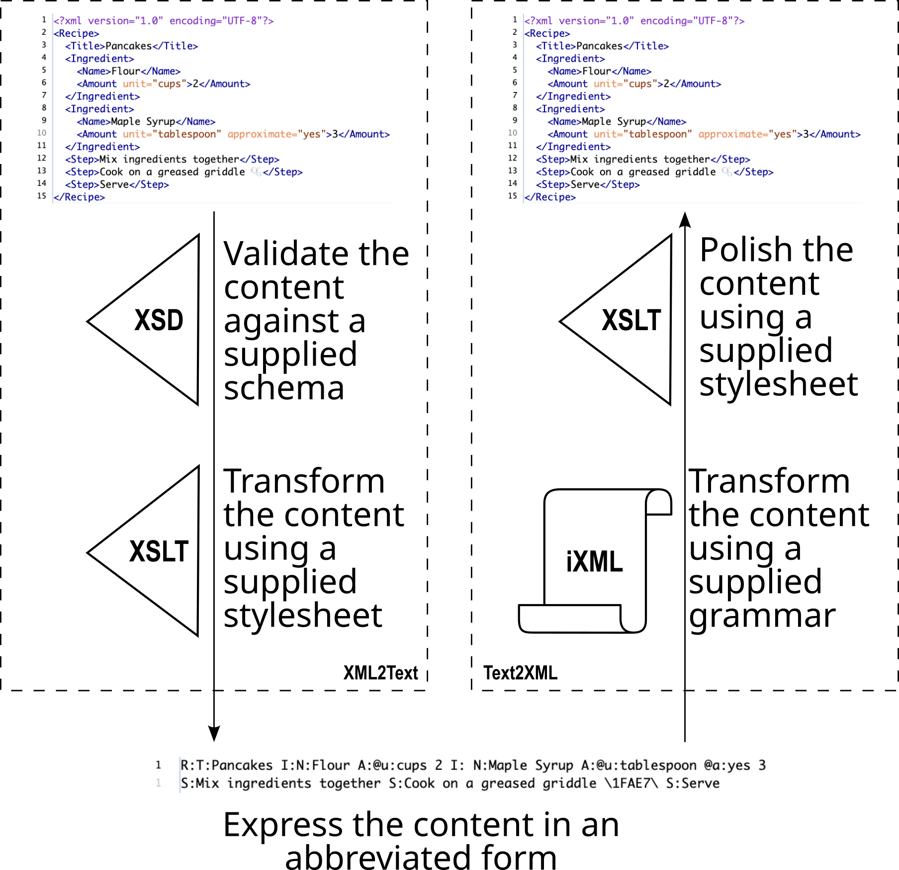

# Scenario: LLM egress and ingress of structured content as compressed text

This directory is a post-mortem of a completed experiment, later
extended with a second round of testing in a follow-up conversation.
Together they tell the story of a user who needs a high volume of
structured results from an LLM, and who is concerned about the token
cost of getting that structure into and out of XML. The scenario
shows both directions: how the Crane-txt2xml environment lets a user
ask the LLM for a *compressed* text notation instead of XML on
egress — at a fraction of the token cost — and, separately, how an
LLM equipped with a real execution environment can run the *ingress*
side of the same toolchain itself, parsing compressed text back into
XML with the user's own iXML grammar and Coffeepot, rather than only
ever producing or consuming XML directly.



For the recipe vocabulary itself (the document model, the four XSD
authoring styles, the iXML grammar, and the short-label and
long-label text conventions), see the recipe directory
[`../recipe/`](../recipe/README.md). This file does not repeat that
description; it only narrates what was *done* with that vocabulary as
a scenario.

## Part one: egress — XML compressed to text by the LLM, expanded back by the user

The story, in order:

1. **An LLM (Claude) synthesized twelve toy recipes, each as a
   schema-valid XML instance**, against the document model in
   `../recipe/recipe-garden-of-eden.xsd` — not as ad hoc structure invented on
   the spot, but as XML conforming to a schema the LLM had been given
   to read. Nine were ordinary recipes; three deliberately exercised
   edge cases in escaping and character content (an embedded quotation
   mark, a literal backslash, and multi-codepoint emoji).

2. **Each XML instance was validated against the schema before
   anything else happened to it.** This is the point in the story
   where structure and content are pulled apart: once an instance
   validates, any error remaining in the result can only be a content
   error — a wrong amount, a mis-stated unit, an implausible step —
   never a structural one (a missing element, a misplaced attribute,
   an unclosed tag). Validation was run not only against the Garden of
   Eden schema but against all four XSD authoring-style variants
   supplied in the parent directory, confirming they are equivalent
   expressions of one model and that the synthesized instances satisfy
   all four.

3. **The only files the user supplied were the schemas and the
   stylesheets** — a small 100K zip combining the two directories [`xsl/`](../xsl/README.md)
   and [`recipe/`](../recipe/README.md) provided all the sufficient files:  
   `recipe-garden-of-eden.xsd` (and its three sibling
   style variants) and `Crane-recipe2short.xsl` together with its
   imports `Crane-xml2txt.xsl` and `Crane-recipe-common.xsl`. No
   utility-directory files, no XSLT processor, no Java runtime, no
   schema validator, and no driver script were uploaded. Every piece
   of software needed to run the schemas and stylesheets — the Java
   runtime, the XSLT 3.0 processor, the schema-validation library —
   was located, retrieved, and installed by the LLM itself, inside its
   own execution environment, in response to the task. The user's
   contribution to this half of the story was the *specification*
   (schema and stylesheet); the *means of executing* that specification
   was the LLM's to find.

4. **The XML was compressed to text by running the user's own
   `Crane-recipe2short.xsl` stylesheet, unmodified, under a real Saxon
   XSLT processor** — not by asking the LLM to imitate, summarize, or
   freehand what that stylesheet would probably output. The
   distinction matters to the story: the compaction step is
   mechanical and deterministic, and its correctness rests on the
   stylesheet's own logic, not on the LLM's recollection or guess of
   what that logic does. The short-label, no-indent, no-label-gap
   default parameters were used throughout, producing text like:

   ```
   R:T:Pancakes I:N:Flour A:@u:cups 2 I:N:Milk A:@u:cups 1.5 I:N:Egg A:@u:whole 2 S:Whisk the dry ingredients together S:Add milk and eggs and mix until smooth S:Cook on a greased griddle until golden S:Serve warm with syrup
   ```

5. **The only files returned to the user were the twelve compressed
   text renditions.** The twelve XML instances synthesized in step 1
   and validated in step 2 were the LLM's own intermediate working
   artifact — necessary internally so that schema validation and the
   stylesheet-driven compaction (step 4) had something to operate on,
   but never sent back. Nothing else crossed back to the user: no
   intermediate XML, no copies of the stylesheets the user already
   had, no installed software. The user received exactly the one
   artifact the scenario is about — the compressed notation — and
   nothing more.

6. **The user expanded the compressed text back into XML on their own
   side**, using their own open-source toolchain — Coffeepot as the
   iXML processor, the `recipe.ixml` grammar (itself generated from
   the schema by `Crane-recipe2ixml.xsl`), and `Crane-ixml2xml.xsl` to
   complete the conversion — orchestrated by
   [`llm-scenario.sh`](llm-scenario.sh) (or its Windows equivalent,
   [`llm-scenario.bat`](llm-scenario.bat), composed alongside this
   README), which calls [`../recipe/one-recipe.sh`](../recipe/one-recipe.sh) once
   per compressed file. This half of the story involves no LLM at all:
   it is the user's own software, on the user's own machine, doing the
   expansion.

This closes part one's round trip entirely on the user's side: the
LLM never ran Coffeepot, only Saxon. Part two, below, tests whether
the LLM can run the ingress half itself.

## Part two: ingress — the LLM running Coffeepot on its own, against real grammars

A follow-up conversation tested the opposite question: rather than the
user expanding compressed text into XML locally, could the LLM itself
retrieve and run a real iXML processor — Coffeepot, not a simulation
of it — against the user's own grammar, the same way part one had it
retrieve and run a real Saxon? Three vocabularies of increasing
grammar size were tried, each supplied directly in conversation by the
user (not pre-staged in this repository the way the twelve recipe
files are):

- **The toy recipe grammar** (`recipe.ixml`, ~8KB) — a freshly written
  compressed-text recipe ("Tea Sandwiches") was parsed by Coffeepot and
  transformed by Saxon in well under a minute combined, producing
  schema-valid XML with no memory pressure at all.
- **A PubMed-vocabulary grammar** (`PubMedIn-short.ixml`, ~33KB) — a
  genuinely complex compressed-text article record, including nested
  affiliations, mixed-content abstracts with labelled sections,
  escaped characters, and a reference list, was parsed by Coffeepot in
  about 49 seconds on the default JVM heap (~1GB) and transformed by
  Saxon in about 2 seconds, producing correct, well-formed XML on the
  first attempt.
- **The full UBL invoice grammar** (`ubl-2.5.ixml`, ~887KB) — Coffeepot
  was given a real UBL 2.1 invoice instance in compressed text and the
  full UBL grammar. It did not complete. Three attempts, with the JVM
  heap raised from the ~1GB default to 3.2GB and then 3.5GB (close to
  this particular environment's entire available memory), all failed
  with `java.lang.OutOfMemoryError: Java heap space`, each time
  partway through Earley parser forest-node construction — deeper into
  the parse with more heap, but never finishing. This is a genuine,
  reproducible resource ceiling in this environment, not a timeout:
  the failures took 53, 166, and 172 seconds respectively to exhaust
  memory and stop, well short of any wall-clock limit.

The honest conclusion from these three points: an LLM with a real
execution environment can run a real iXML processor against a real
grammar and a real compressed-text instance, end to end, with no
simulation involved — but the grammar's size, not elapsed time, is
what determines whether it can. Somewhere between a 33KB grammar
(comfortable) and an 887KB grammar (infeasible here), this particular
environment's memory ceiling is crossed. A different LLM execution
environment with more available memory might move that ceiling
considerably further out; a constrained one might move it
considerably closer in. The number itself is specific to one
container in one conversation and shouldn't be treated as a fixed
property of LLMs generally — but the *shape* of the result, a hard
resource wall rather than a graceful slowdown, is the useful finding.

## Where the cost lies, and where it doesn't, in both directions

This is the crux the scenario is meant to illustrate for a user
weighing whether high-volume structured output from an LLM is
affordable:

- **There is no LLM-side execution cost to the user.** Locating,
  installing, and running the Java runtime, the Saxon XSLT processor,
  and the schema validator all happened inside the LLM's own
  environment, as part of the conversation. None of that consumes the
  user's tokens; tokens are consumed only by the conversation itself.

- **The user's token cost is specifically the upload of the
  stylesheets and schemas, and the download of the compressed text
  results** — not the XML. The stylesheets and schemas were read once,
  at the start of the conversation, as input tokens. The compressed
  text returned at roughly 43% of the corresponding XML's byte size
  in this sample (see the table below), and at a proportionally
  larger savings in LLM *tokens*, since XML's punctuation-heavy
  angle-bracket syntax tends to fragment into more tokens per byte
  than plain compressed text does. No XML needed to be generated as
  output tokens at any point to get a structurally correct,
  schema-conformant result, and none was.

- **There is no LLM-side cost, and no token cost at all, for the
  user's own expansion of the compressed text back into XML.** That
  step runs entirely on the user's machine, using open-source software
  the user already controls (Coffeepot, Saxon, the shell or batch
  scripts), against a grammar (`recipe.ixml`) generated once from the
  schema. Running it twelve times, or twelve thousand times, costs the
  same: nothing, beyond ordinary local compute.

- **When the LLM runs the ingress side itself, as in part two, the
  token cost is of the same kind as part one's — uploading a
  specification once, as input tokens — not a new kind of cost.** Part
  one's specification was a schema and a stylesheet; part two's was an
  iXML grammar and a stylesheet. What differs between the two parts is
  scale and reuse, not principle. In part one, the four small XSDs and
  `Crane-recipe2short.xsl` together were uploaded once and covered the
  synthesis of all twelve recipes — the upload cost was amortized
  across many outputs. In part two, the grammar itself is the bulkier
  artifact, and its size varied enormously across the three
  vocabularies tried: 8KB for the toy recipe, 33KB for PubMed, 887KB
  for UBL. A schema expresses structure declaratively and stays terse
  regardless of vocabulary complexity; a grammar generated from that
  same schema has to spell out the full parsing logic — every literal
  token, every structural alternative — and grows accordingly. The
  UBL grammar was both the most expensive of the three to upload and,
  as part two showed, too large for this environment to execute at
  all. The egress direction never had to confront that ceiling, because
  compressing already-valid XML through a stylesheet doesn't carry the
  same grammar-size dependency that parsing compressed text back into
  XML does.

## A caution belonging to this story

The reliability shown in part one — schema-valid XML synthesized
correctly, compressed correctly via the user's own stylesheet, and
(on the user's side) expanded back without loss — rests on the LLM
actually being able to retrieve and run a real XSLT processor and a
real schema validator against the user's own code, rather than asking
the LLM to narrate or approximate what that code does. Not every LLM,
and not every environment an LLM runs in, has that
retrieval-and-execution capability available, or applies it as a
matter of course rather than answering directly from training. A user
relying on this approach should confirm that whatever LLM and
environment they are using actually executed the supplied schema and
stylesheet — and didn't simply produce text that resembles what it
might output.

Part two adds a second, more concrete caution to that general one:
even granted genuine retrieval-and-execution capability, the
environment the LLM runs in has finite resources, and a real iXML
grammar can exceed them well short of any wall-clock timeout. The UBL
result above is not a hypothetical — it is a measured, reproducible
failure in one specific environment, at one specific point on the
spectrum from an 8KB toy grammar to an 887KB production one. A user
planning to rely on an LLM running ingress for a large or complex
vocabulary should not assume success just because a smaller-grammar
case succeeded; the failure mode here was abrupt (an exhausted heap)
rather than gradual, so there is little warning between "comfortably
within capacity" and "fails outright" as grammar size grows.

## Compression observed in part one (XML bytes vs. short-text bytes)

The "XML bytes" column below reflects the internal working artifact,
never returned to the user. It is shown only to quantify the
compression the user received by getting back compressed text
instead. This table covers part one only; part two's three
vocabularies are too few and too disparate in size to support a
similar table, and its result was about whether ingress completed at
all, not how much it compressed.

| file | XML bytes | short-text bytes | ratio |
|---|---|---|---|
| r01-pancakes | 546 | 222 | 40.7% |
| r02-scrambled-eggs | 253 | 102 | 40.3% |
| r03-grilled-cheese | 549 | 238 | 43.4% |
| r04-tomato-soup | 664 | 275 | 41.4% |
| r05-caesar-salad | 579 | 261 | 45.1% |
| r06-aglio-e-olio | 725 | 325 | 44.8% |
| r07-hard-boiled-egg | 407 | 217 | 53.3% |
| r08-banana-smoothie | 517 | 208 | 40.2% |
| r09-toast-with-butter | 350 | 121 | 34.6% |
| r10-chicken-stir-fry | 992 | 432 | 43.5% |
| r11-lemonade | 623 | 298 | 47.8% |
| r12-rice-pilaf | 694 | 303 | 43.7% |
| **TOTAL** | **6899** | **3002** | **43.5%** |

This is byte compression, measured directly from the files in this
directory. It understates the token savings that motivate the
scenario, since XML's angle brackets and closing tags tend to
tokenize less efficiently than the compressed notation's plain
delimiters — a separate, larger effect this table doesn't measure.

## Part one's prompt: what produced the twelve recipes

The synthesis step (point 1 above) was requested of the LLM, in the
conversation that produced this scenario, as follows:

> Attached is a ZIP of two directories, one describing properties of
> an XML vocabulary for recipes. The other is a support stylesheet
> directory.
>
> Please conceive of a dozen simple toy recipes as XML structures
> conforming to the XSD, create valid XML for them, and then serialize
> from them the simple text renditions using the
> Crane-recipe2short.xsl stylesheet.
>
> This is to test the premise that I can export from an LLM a
> compressed version of a corpus of XML that I then can realize back
> as angle brackets using my new environment.

A follow-up exchange narrowed two open choices before synthesis began:
a mix of mostly straightforward recipes with two or three deliberate
edge cases (rather than either uniformly simple or uniformly
adversarial), and the short-label compressed form only (rather than
showing both long-label and short-label renditions side by side).

## Part one's script: what expanded the results back to XML

[`llm-scenario.sh`](llm-scenario.sh) is the script that ran the
expansion, once per compressed file, on the user's side:

```sh
#!/bin/bash

set -e

DP0=$( cd "$(dirname "$0")" ; pwd -P )

sh "$DP0/../recipe/one-recipe.sh" "r01-pancakes.short.txt" "r01-pancakes.short.txt.xml"
sh "$DP0/../recipe/one-recipe.sh" "r02-scrambled-eggs.short.txt" "r02-scrambled-eggs.short.txt.xml"
sh "$DP0/../recipe/one-recipe.sh" "r03-grilled-cheese.short.txt" "r03-grilled-cheese.short.txt.xml"
sh "$DP0/../recipe/one-recipe.sh" "r04-tomato-soup.short.txt" "r04-tomato-soup.short.txt.xml"
sh "$DP0/../recipe/one-recipe.sh" "r05-caesar-salad.short.txt" "r05-caesar-salad.short.txt.xml"
sh "$DP0/../recipe/one-recipe.sh" "r06-aglio-e-olio.short.txt" "r06-aglio-e-olio.short.txt.xml"
sh "$DP0/../recipe/one-recipe.sh" "r07-hard-boiled-egg.short.txt" "r07-hard-boiled-egg.short.txt.xml"
sh "$DP0/../recipe/one-recipe.sh" "r08-banana-smoothie.short.txt" "r08-banana-smoothie.short.txt.xml"
sh "$DP0/../recipe/one-recipe.sh" "r09-toast-with-butter.short.txt" "r09-toast-with-butter.short.txt.xml"
sh "$DP0/../recipe/one-recipe.sh" "r10-chicken-stir-fry.short.txt" "r10-chicken-stir-fry.short.txt.xml"
sh "$DP0/../recipe/one-recipe.sh" "r11-lemonade.short.txt" "r11-lemonade.short.txt.xml"
sh "$DP0/../recipe/one-recipe.sh" "r12-rice-pilaf.short.txt" "r12-rice-pilaf.short.txt.xml"
```

It in turn calls [`../recipe/one-recipe.sh`](../recipe/one-recipe.sh), which invokes
`../shell/Crane-txt2xml.sh` with `recipe.ixml` and
`../xsl/Crane-ixml2xml.xsl` against each compressed input file.

A Windows batch equivalent, [`llm-scenario.bat`](llm-scenario.bat),
calls [`../recipe/one-recipe.bat`](../recipe/one-recipe.bat) once per compressed
file, mirroring [`llm-scenario.sh`](llm-scenario.sh)'s call to [`../recipe/one-recipe.sh`](../recipe/one-recipe.sh), with
explicit `errorlevel` checking after each call.

## Part two's method: how the LLM ran ingress itself

Unlike part one, part two's three test cases were not pre-staged as
files in this repository — the grammar, stylesheet, and compressed
text for each were supplied directly in a follow-up conversation, and
the LLM ran the conversion live rather than the user running a script
locally. For each vocabulary, the LLM:

1. retrieved its own copy of Coffeepot and Saxon (the same jars used
   throughout this repository, fetched from this project's own GitHub
   repository rather than installed by the user),
2. ran Coffeepot directly — `java -Xss16m -jar coffeepot.jar -i
   <compressed-text> -g <grammar.ixml> -o <intermediate.xml>
   --mark-ambiguities --input-newline` — against the supplied grammar
   and compressed text,
3. ran Saxon directly — `java -cp saxonhe.jar net.sf.saxon.Transform
   -s:<intermediate.xml> -xsl:<ixml2xml-stylesheet> -o:<result.xml>` —
   against the Coffeepot output, and
4. validated the result against the relevant schema where one was
   available (the recipe case only; PubMed and UBL were tested for
   successful, well-formed conversion rather than schema validation).

For the UBL case, after the default JVM heap (~1GB) failed, the LLM
retried twice more with `-Xmx3200m` and then `-Xmx3500m` — close to
the entire memory available in that conversation's execution
environment — before concluding the grammar could not be processed
there. No files from part two's three test cases are included in this
directory; the conversation transcript and the LLM's reported timings
and outcomes are the only record of that work. A reader wanting to
reproduce part two would need the PubMed and UBL grammars and
stylesheets from elsewhere in this project (or the UBL subproject) and
a compressed-text instance to test against.

## Manifest

This manifest covers part one's files only, all of which live in this
directory. Part two produced no files here; see the note above.

[`README.md`](README.md)
- this file

[`llm-scenario.sh`](llm-scenario.sh)
- shell script expanding all twelve compressed text files into XML

[`llm-scenario.bat`](llm-scenario.bat)
- Windows batch equivalent of `llm-scenario.sh`, calling
  `../recipe/one-recipe.bat` once per file; correct operation depends on
  `setlocal` being present in `one-recipe.bat` and `Crane-txt2xml.bat`
  (see the note above)

[`r01-pancakes.xml`](r01-pancakes.xml) … [`r12-rice-pilaf.xml`](r12-rice-pilaf.xml)
- the twelve LLM-synthesized recipe instances, each schema-valid
  against all four XSD authoring styles in the parent directory.
  These were the LLM's own working artifacts, used internally for
  validation and compaction; they were not returned to the user as 
  part of the experiment, only after the fact for the purpose of comparison testing.
  They are included here only so a reader can verify the round trip by
  comparing against the `.short.txt.xml` files below

[`r01-pancakes.short.txt`](r01-pancakes.short.txt) … [`r12-rice-pilaf.short.txt`](r12-rice-pilaf.short.txt)
- the corresponding compressed text, produced by running the user's
  own `Crane-recipe2short.xsl` against each `.xml` file

[`r01-pancakes.short.txt.xml`](r01-pancakes.short.txt.xml) … [`r12-rice-pilaf.short.txt.xml`](r12-rice-pilaf.short.txt.xml)
- the XML recovered by expanding each `.short.txt` file through
  `llm-scenario.sh`, closing the round trip

[`recipeWaffles.txt`](recipeWaffles.txt)
- a test recipe written for ingress to the LLM to convert to XML in its sandbox before using the XML stack

[`recipeWaffles.xml`](recipeWaffles.xml)
- the result of the test exported on request from the LLM

*Editor's note: Claude was prompted to create the initial version of
this post-mortem as it knew the details of what it was
doing as part of the experiment.*